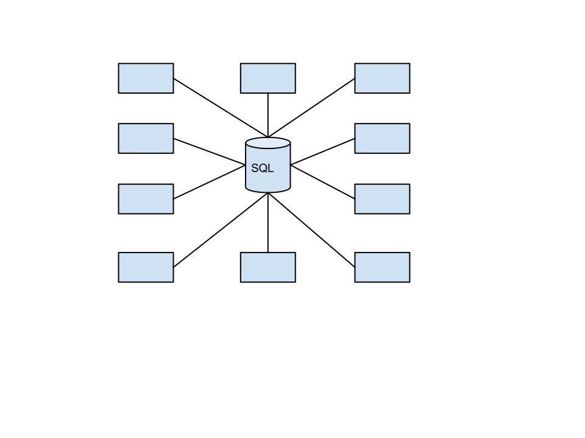
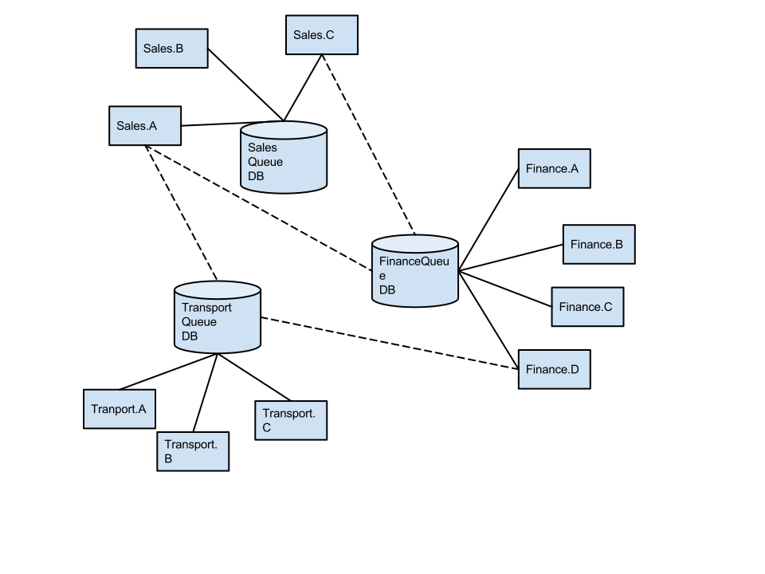

# Improving SQL Server Transport performance

When using the SQL Server transport you get a robust and solid transactional environment where most ops and dev members are familiar with. In a regular setup the transport is configured as a broker. All messages that are send flow through one SQL database. In the default configuration the SQL Server Transport is using one database on one server where each queue is represented by one table. Read [Configuration](Configuration.md) to see schema details.

Usually this is not a real problem when your system is not hitting a large number of messages per second as in less then 1000/s. That number can usually be easily achieved by upscaling the server and using a good write caching disk controller.

Next is the network performance which also has its limits even when using 10gbit ethernet and leads to all kind of assumptions ([Fallacies of distributed computing](https://en.wikipedia.org/wiki/Fallacies_of_distributed_computing)). Here we see a problem with the topology of the SQL Server transport due to all message flowing throught one database. 

## Vertical scaling (scale up)

Suppose that we have several services generating that much message during peak hours that a backlog of message is created. Not really a problem but it is when SLA agreements cannot be met soon! Usually you would start in optimizing SQL server by applying best practices and making sure you are tuning the server as optimal as possible by using seperate storage for log files, indexes and filegroups. Then the usual scale up resources  are added by using faster solid state disks, increasing the cache on your disk controllers or removing other I/O bottlenecks by adding more RAM or CPU's or improve network speeds by investing in faster network hardware.

There will be a moment in time where upscaling just wont work any more. If its not because of performance issues it could just as well be because of keeping such an environment available. It becomes a single point of failure and making sure such an environment is high available and fault tolerant is a operations nightmare.

## Horizontal scaling (scale out)

This is where multi instance support on the SQL Transport is a nice additional feature to improve performance when I/O performance issues can only be solved by outscaling as-in having additional physical servers to distribute the load. Multi instance support in the SQL Server Transport helps in solving common Enterprise configuration and/or I/O performance issues.

Since v4 its possible to use multiple databases location on different servers. This feature is called multiple instance support.

All regular features are supported like:

- Auto subscription are supported
- Multiple subscriber instances are supported
- Multiple publisher instances are supported
- Outscaling possibilities instead of only supporting upscaling
- Distributed Transactions are supported

There can be different reasons for using the multi instance support:

- Seperating high load queues so SLA agreements are not breached.
- Using a large number of simple low performance databases to reduce a single point of failure.
- Having first build several independant applications but using the same technology stack and that now need to exchange events.
- The NHibernate storage is also used and it seems logical to group related queue, timeout and saga data in one or several databases.

## Remarks

- Endpoint connection strings need to be configured explicitly which can be tricky
- When a subscriber queue is not available the transaction fails as we do not have a default store and forward behavior that MSMQ has. This can be resolved by using the outbox pattern. See [Reliable messaging without MSDTC](http://docs.particular.net/nservicebus/no-dtc)

## Multiple publishers or subscribers on multiple databases or servers

Multiple instance support with the SQL Server Tranport works on:

- Multiple publishers on different instances
- Multiple subscribers on different instances

An instance is either a SQL Server:
 - catalog
 - instance
 - host / machine

## Behavior explained

### Default single instance behavior

The subscription logic is similar to MSMQ where you have to configure to which publisher instance you want to subscribe in the `UnicastBusConfig` configuration section.

The following configuration indicates that `Publisher.Messages` command messages should to be send to endpoint queue `Publisher`.

	<UnicastBusConfig>
		<MessageEndpointMappings>
			<add Assembly="Publisher.Messages" Endpoint="Publisher" />
		</MessageEndpointMappings>
	</UnicastBusConfig>

When the NServiceBus SQL Server transport is invoked to subscribe to events from `Publisher` it will connect to the database server and catalog configured in the connection string `NServiceBus/Transport` like the following.

	<connectionStrings>
		<add name="NServiceBus/Transport" connectionString="Data Source=uberdatabase.lan;Initial Catalog=SqlTransport;Integrated Security=True" />
	</connectionStrings>

It will then subscribe to the publisher `Publisher` by 'sending' a subscribtion message to endpoint `Publisher` what basically means inserting a record in table `SqlTransport.dbo.Publisher`.

The publisher will process this message and adds the subscriber information to the configured subscription storage. When a message is published by CustomerCare it retrieves a collection of subscribers for the messages and sends an event message to each subscribers end-point queue. In this case lets assume that is endpoint `Subscriber` which would mean it inserts a record in table `SqlTransport.dbo.Subscriber`. This will then eventually be processed by the subscriber.

### Multiple instance behavior

The behavior for multiple instances is similar to above. The SQL Server Transport retrieves the connection string for the SQL Transport storage. The difference is that the logic first tries if a endpoint specific connection string is configured and use that and else use the regular SQL Transport connection string.

For example, when the subscriber runs its auto subscribtion it detects that it needs to subscribe to endpoint `Publisher`. It then tries to retrieve connection string `NServiceBus/Transport/Publisher`. If it succeeds it connects to the given connectionstring and inserts a record in the table `{Catalog}.dbo.Publisher`. If it fails to retrieve an endpoint specific connection string it will use the regular `NServiceBus/Transport` connection string.

The exact same logic would happen when an event message is published. The publisher retrieves the subscriptions for a message type and these subscription items refer to an endpoint and do not contain connection information. The SQL Transport then retrieve connection info from the configured connection strings.

So how do we subscribe to an instance where the queues are stored on a different server or database? First we need to add the connection string of the publisher database to the connection string configuration section.

	<connectionStrings>
		<add name="NServiceBus/Transport" connectionString="Data Source=uberdatabase.lan;Initial Catalog=SqlTransport;Integrated Security=True" />
		<add name="NServiceBus/Transport/Customer" connectionString="Data Source=customercasedb.lan;Initial Catalog=SqlTransport;Integrated Security=True" />
	</connectionStrings>

## Configuration

Each endpoint that runs at another instance then the default SQL Server Transport connection string `NServiceBus/Transport` needs an additional connection string.

Imagine that we have 'Sales' and 'CustomerCare' endpoints. All 'Sales' endpoints share the same SQL Transport storage as do all 'CustomerCare' endpoints. If a certain 'Sales' endpoint needs to deliver either command or event messages to 'CustomerCare.CustomerNotifications' and 'CustomerCare.CallbackScheduler' then a connectionstring for both endpoints need to be explicitly configured.

	<connectionStrings>
		<add name="NServiceBus/Transport" connectionString="Data Source=salesdb.lan;Initial Catalog=SqlTransport;Integrated Security=True" />
		<add name="NServiceBus/Transport/CustomerCare.CustomerNotifications" connectionString="Data Source=customercaredb.lan;Initial Catalog=SqlTransport;Integrated Security=True" />
		<add name="NServiceBus/Transport/CustomerCare.CallbackScheduler" connectionString="Data Source=customercaredb.lan;Initial Catalog=SqlTransport;Integrated Security=True" />
	</connectionStrings>

This usually is not a big issue when sending a command as usually the developer knows to check if the UnicastBusConfig has the endpoint defined and can easily check the connectionstrings. It is different for event messages. It could be that a component wants to subscribe to a publisher on a different instance which could succeed when the subscriber is configured correctly but the publisher could fail in delivering the event message when its SQL Transport connection string does not have the connection string of the subscriber endpoint.

All endpoints on a different instance need to be explicitly configured.

## Example

The [NServiceBus.SqlServer.Samples](https://github.com/Particular/NServiceBus.SqlServer.Samples/) have been extended with an working example. See its [README](https://github.com/Particular/NServiceBus.SqlServer.Samples/blob/master/VideoStore.SqlServer.MultiInstance/README.md) for details

## References

- [SqlServerMessageSender implementation](https://github.com/Particular/NServiceBus.SqlServer/blob/master/src/NServiceBus.SqlServer/SqlServerMessageSender.cs)
- [Enterprise configuration using SQL transport](https://github.com/Particular/NServiceBus.SqlServer/issues/22)
- [Scalability](https://en.wikipedia.org/wiki/Scalability)